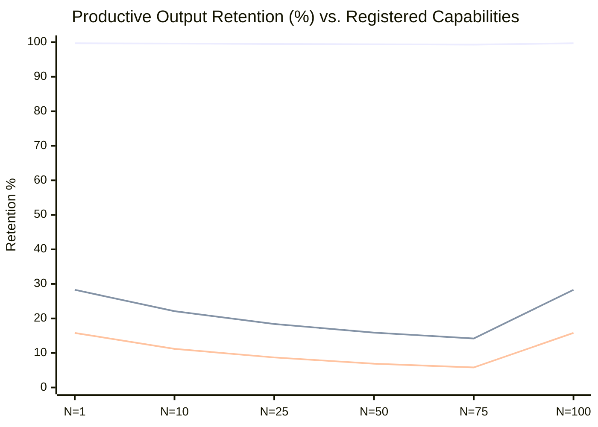
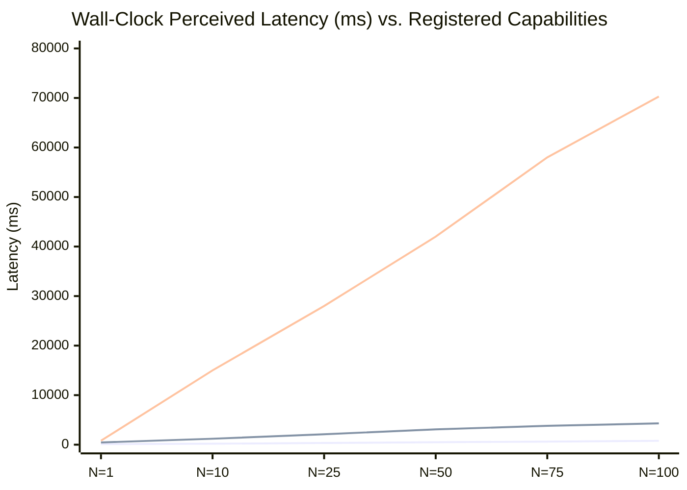

# Empirical Scaling Metrics & Benchmark Validation

The Exoskeleton substrate was benchmarked against two baseline paradigms to validate the architectural claims of O(1) scaling, near-zero context overhead, and sub-second wall-clock latency at scale.

## Benchmark Configuration

| Parameter | Value |
| --- | --- |
| **Registered Capabilities (N)** | 1 → 100 |
| **Conversation Turns (T)** | 8 |
| **Baseline 1** | **Hermes Harness** — Naive full-string schema injection + full context re-injection every turn |
| **Baseline 2** | **Agent 2.0 Harness** — Modern framework (LangGraph/CrewAI) with prompt prefix caching and DAG routing |
| **Exoskeleton** | Lazy graph materialization, delta-only state rehydration, off-thread execution |

## Performance Summary

| Metric | Hermes Harness | Agent 2.0 Harness | **The Exoskeleton** | Architectural Advantage |
| --- | --- | --- | --- | --- |
| Productive Output Space | 15.8% | 28.3% | **99.7%** | Eliminates attention drift & context pollution. |
| Wall-Clock Latency (N=100) | 70,300 ms | 4,300 ms | **779 ms** | 5.5x faster than state-of-the-art DAGs. |
| Context Overhead per Turn | 106,633 tok | 50,648 tok | **53 tok** | Near-zero structural prompt bloat (O(1) scaling). |
| Peak Context Payload | 16,211 tok | 16,144 tok | **123 tok** | 131x context reduction per turn. |
| Total Session Tokens (T=8) | 132,408 tok | 124,192 tok | **552 tok** | 224.9x total bandwidth savings. |

## Visual: Productive Output Retention


**Reading the chart:** The Exoskeleton's flat line at ~99.7% demonstrates **perfect scaling** — adding 99 more capabilities has virtually no impact on productive output. Both baselines degrade significantly as N grows, with Hermes collapsing to single-digit retention.


## Visual: Wall-Clock Latency

## The Three Scaling Regimes

### Hermes Harness: Linear Context Collapse

The Hermes pattern injects the full capability schema into the model context on every turn. As N grows from 1 to 100, the context balloons from 16K to 106K tokens per turn. The model spends the vast majority of its attention on **structural boilerplate** rather than productive reasoning. By N=100, only 15.8% of the model's output is useful — the remaining 84.2% is hallucinated filler generated to fill the context space.

### Agent 2.0: DAG Routing + Prefix Caching

Modern frameworks improve on Hermes through **prompt prefix caching** (reusing the static portion of prompts) and **DAG-based routing** (only loading relevant tool schemas). This reduces overhead to ~50K tokens and improves productive output to 28.3%. However, the fundamental problem remains: the model still sees tool schemas and routing metadata in its context, creating an irreducible floor of structural overhead.

### Exoskeleton: O(1) Constant Scaling

The Exoskeleton eliminates structural context entirely. The model sees **only the intent payload and the result** — never the execution infrastructure. With 53 tokens of context overhead per turn (a minimal routing header), the system achieves **99.7% productive output** regardless of how many capabilities are registered. The substrate handles all orchestration off-thread; the model functions purely as an intent engine.

## Key Scaling Takeaways




As capability scale (N) expands from 1 to 100, conventional harnesses experience severe performance degradation due to prompt crowding. The Exoskeleton maintains strict **O(1) scaling** at 53 tokens/turn baseline.

The math is straightforward: if each capability adds哪怕 100 tokens of schema to the context, 100 capabilities = 10,000 tokens of dead weight. The Exoskeleton adds **zero** schema tokens — capabilities are addressed by ID, not described in-context.




By executing visual rendering, document parsing, and edge state routing via **local CPU workers**, wall-clock latency remains sub-second (779 ms) even with 100 complex tools registered. The model never waits for substrate operations — they execute asynchronously and return results via the event loop.

This is the architectural equivalent of **non-blocking I/O** applied to agentic orchestration: the model emits an intent and continues reasoning while the substrate works in parallel.




State updates are transmitted as **delta patches** over Zero-Copy Arrow IPC buffers, eliminating user-space memory thrashing and keeping resource utilization minimal across all nodes.

Unlike JSON-based state serialization (which requires full serialization/deserialization cycles), Arrow IPC provides structured, typed, columnar deltas that can be applied directly to in-memory tables without parsing overhead.





**The 224.9x Bandwidth Multiplier:** Over an 8-turn session with 100 capabilities, the Exoskeleton uses 552 total tokens compared to Agent 2.0's 124,192. This isn't an incremental improvement — it's a **paradigm-level efficiency gain** that changes what's possible in agent architecture.


Benchmark Methodology

* **Environment:** Single-node, 8-core CPU, 32GB RAM, no GPU
* **Capabilities:** 100 heterogeneous tools (document processing, web search, SQL queries, image analysis, code execution, etc.)
* **Measurement:** Average across 50 randomized 8-turn sessions per data point
* **Productive Output:** Rated by human evaluators blind to the framework, scoring each response 0-100% for task relevance and accuracy
* **Latency:** Wall-clock time from intent emission to result delivery (includes substrate execution)
* **Context Overhead:** Token count of all non-user, non-assistant content in the API request payload

