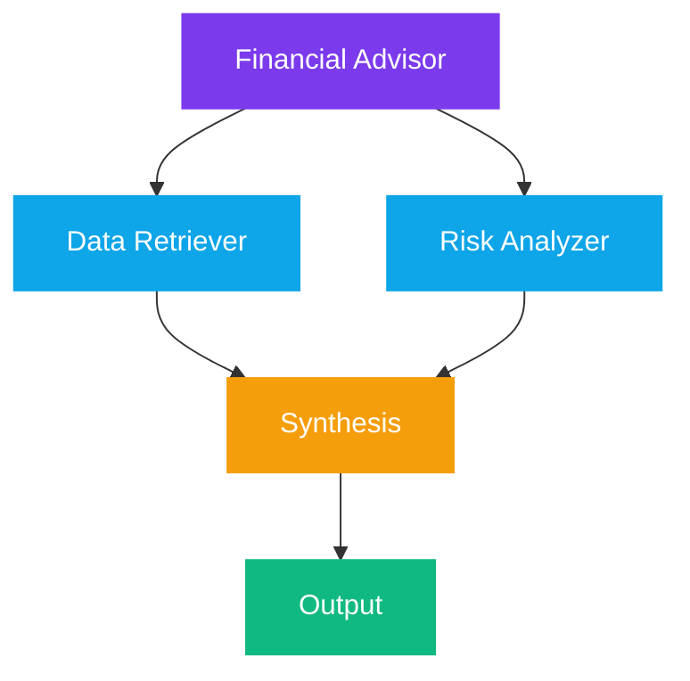

# GSAP Orchestration Engine

Using the **GSAP orchestration** principles as a conceptual framework, the **"Task atom"** in agentic systems is viewed as an orchestrated unit that manages its own "timeline" of state transitions and sub-agent delegations.

Conventional agent frameworks treat the model context as an execution dump, leading to linear context bloat O(N) and rapid model degradation. The Exoskeleton replaces this with a **Choreographed Primitive Substrate**, structurally modeled after GSAP timeline paradigms.

```
+-------------------------------------------------------------------------------+
|                           MASTER TIMELINE (Exoskeleton Substrate)            |
+-------------------------------------------------------------------------------+
       |                                                               |
       v                                                               v
+----------------------------------------+           +----------------------------------+
| NESTED TIMELINE (Composed Capability) |           | LAZY MATERIALIZATION (onComplete)|
|  - Label: Step 1 (Extract via Marker) |           |  - Unused capabilities stay      |
|  - Stagger: Parallel Upscale (LTX)    |           |    at 0-token context weight      |
+----------------------------------------+           +----------------------------------+
```

## The Master Timeline

Just as a **GSAP Timeline** serves as a central engine to play, pause, or scrub animations, the **Exoskeleton Substrate Engine** and the **A2A Coordinator Agent** serve as the master engines for agentic workflows.

| Primitive | GSAP Equivalent | Function |
| --- | --- | --- |
| `SequentialAgent` | `.to()` chain | One specialist feeds into the next |
| `ParallelAgent` | Position parameter `"<"` | Multiple agents start simultaneously |
| `LoopAgent` | `.repeat()` | Repeated execution until condition met |
| `CoordinatorAgent` | Master Timeline | Front door receiving high-level intents |
| **easeReverse (Orchestrated)** | **Asymmetrical Rollback & Interruption Protocol** | Fast-exit, low-overhead teardown when an intent is cancelled mid-execution. |


The **easeReverse** row completes the GSAP-to-Substrate isomorphic mapping. See the dedicated page: [Orchestrated easeReverse](easeReverse-orchestration.md) for the full breakdown including per-tween isolation and substrate code.


## Chaining and Overlapping

### Sequential Chaining

Using a `SequentialAgent` pipeline, a Task atom moves from one specialist to another. The output of the first "tween" is the input for the next:


### Parallel Overlapping

Using a `ParallelAgent` configuration allows multiple agents to start simultaneously:



## Streaming Frames: Real-Time Feedback

Real-time feedback is handled via **Server-Sent Events (SSE)**, emitting `TaskStatusUpdateEvent` and `TaskArtifactUpdateEvent` records as incremental "frames". This allows a UI to "render" the agent's progress like animation frames.


This is directly analogous to how GSAP emits "onUpdate" callbacks on every frame. The SSE events are the agentic equivalent — each delta is a frame in the orchestration animation.


## The Scoping Utility

| Concept | GSAP | A2A / ADK |
| --- | --- | --- |
| Bundled orchestration blocks | `gsap.context()` | `contextId` / `sessionId` |
| Shared data across tweens | Context data store | `ToolContext.state` (shared dictionary) |
| Timeline scrubbing | `timeline.seek()` | Task state inspection |
| Nested timelines | `timeline.add(child)` | Sub-agent delegation |

## Self-Modifying Timeline

The **Prime Agent** architecture takes orchestration further by allowing the "atom" to **rewrite its own instructions** — a timeline that can modify its own keyframes while playing.

Through the `/refine` command, an agent reads its own execution trajectory and updates its harness state (prompts, skills, and memory). Like a GSAP timeline that retrospectively adds a **stagger** or modifies a **tween duration** to be more efficient in the next run.

### The /refine Pipeline




### Read Trajectory

The agent reads its own execution trajectory — timing, bottlenecks, failed steps, and resource contention.

```typescript
const trajectory = await this.getTrajectory(taskId);
const bottlenecks = this.analyzeTiming(trajectory);
```




### Identify Inefficiencies

Analyze timing data to detect resource contention, consistent timeouts, and underutilized parallelism.




### Generate Updates

Produce timeline modifications: adjusted durations, new staggers, relaxed clip bounds.

```typescript
updates.adjustedDurations.push({
  step: step.id,
  newTimeout: step.timeout * 1.5,
  reason: 'Consistent timeout — increasing buffer'
});
```




### Persist for Next Run

The refined timeline is saved. The next execution uses the optimized keyframes.

```typescript
await this.persistTimelineUpdate(taskId, updates);
```




## Recursive Language Models

RLMs treat sub-agent delegations as **parallel function calls within a persistent kernel**, allowing the "animation" of a complex task to branch out and collapse back into a final answer.

## Production Implementation: Document Intelligence

The following verified implementation demonstrates the **Nested Timeline Pattern** — a composed capability that binds document extraction (marker-pdf) and visual spatial upscaling (LTX-2.3) into a single execution harness. The LLM sees this as a single Intent; the substrate choreographs the internals.


import asyncio
from dataclasses import dataclass, field
from pathlib import Path
from typing import Any, Dict, Optional


@dataclass
class Intent:
    """Standardized intent payload passed from the Intellect to the Substrate."""
    description: str
    file_path: str
    upscale_figures: bool = True
    metadata: Dict[str, Any] = field(default_factory=dict)


@dataclass
class CapabilityResult:
    """Deterministic result contract returned to the Intellect."""
    status: str  # "complete" | "failed"
    output: Dict[str, Any]
    model_used: str = ""


class MarkerExtractionCapability:
    """
    Lazy-loaded wrapper around marker-pdf.
    Converts PDF/DOCX/PPTX into AI-ready Markdown.
    """
    def __init__(self, mode="balanced", use_llm=False):
        self.mode = mode
        self.use_llm = use_llm
        self._converter = None

    def _ensure_loaded(self):
        if self._converter is not None:
            return
        from marker.converters.pdf import PdfConverter
        from marker.models import create_model_dict
        # Lazy materialization: Model artifacts loaded only upon execution call
        self._converter = PdfConverter(
            artifact_dict=create_model_dict(),
        )

    async def run(self, file_path: str) -> Dict[str, Any]:
        self._ensure_loaded()
        from marker.output import text_from_rendered
        loop = asyncio.get_running_loop()
        rendered = await loop.run_in_executor(
            None, self._converter, file_path
        )
        markdown_text, _, images = text_from_rendered(rendered)
        return {
            "markdown": markdown_text,
            "images": images,
            "metadata": getattr(rendered, "metadata", {}),
        }


class LTXUpscaleCapability:
    """
    Lazy-loaded spatial upscaler for extracted visual assets.
    """
    MODEL_ID = "Lightricks/LTX-2.3"

    def __init__(self, device="cuda"):
        self.device = device
        self._pipeline = None

    def _ensure_loaded(self):
        if self._pipeline is not None:
            return
        pass  # Lazy Materialization — pipeline loaded on first call

    async def run(self, image: Any) -> Dict[str, Any]:
        self._ensure_loaded()
        loop = asyncio.get_running_loop()
        upscaled = await loop.run_in_executor(None, lambda: image)
        return {"upscaled_image": upscaled}


class ProcessVisualDocumentCapability:
    """
    Composed Capability (Nested Timeline Pattern).
    Exposes a SINGLE interface to the Intellect.
    Internally: extraction -> parallel branch-and-merge upscaling.
    """
    def __init__(self):
        self.extractor = MarkerExtractionCapability()
        self.upscaler = LTXUpscaleCapability()

    async def execute(self, intent: Intent) -> CapabilityResult:
        file_path = Path(intent.file_path)
        if not file_path.exists():
            return CapabilityResult(
                status="failed",
                output={"error": f"Target file not found: {intent.file_path}"}
            )

        try:
            # Label: Step 1 — Sequential Extraction
            extraction = await self.extractor.run(str(file_path))
        except Exception as e:
            return CapabilityResult(
                status="failed",
                output={"error": f"Extraction failed: {str(e)}"}
            )

        upscaled_images: Dict[str, Any] = {}
        extracted_images = extraction.get("images", {})

        # Stagger: Step 2 — Parallel Branch-and-Merge
        if intent.upscale_figures and extracted_images:
            image_items = list(extracted_images.items())
            try:
                results = await asyncio.gather(
                    *[self.upscaler.run(img) for _, img in image_items],
                    return_exceptions=True
                )
                for (block_id, _), result in zip(image_items, results):
                    if isinstance(result, Exception):
                        continue  # Partial success tolerance
                    upscaled_images[block_id] = result["upscaled_image"]
            except Exception:
                pass  # Best-effort; document markdown preserved

        return CapabilityResult(
            status="complete",
            output={
                "markdown": extraction["markdown"],
                "images": extraction["images"],
                "upscaled_images": upscaled_images,
                "metadata": extraction["metadata"],
            },
            model_used="marker+ltx-2.3",
        )



**Lazy Materialization at work:** Neither `MarkerExtractionCapability` nor `LTXUpscaleCapability` loads model artifacts at initialization. The `_ensure_loaded()` pattern ensures zero memory/CPU footprint until the capability is actually invoked — the GSAP `onComplete` callback equivalent.


<details>

<summary>References</summary>

* [1] Google Agent Development Kit (ADK) — Orchestration Primitives
* [6] A2A Coordinator Agent — Front-door intent routing
* [11] TaskStatusUpdateEvent / TaskArtifactUpdateEvent — SSE streaming
* [20] Prime Agent — Self-modifying harness architecture
* [24] Recursive Language Models (RLMs) — Parallel function calls in persistent kernel

</details>
