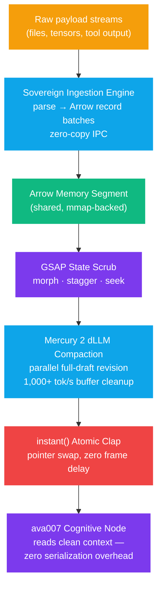

# Instant Injection & Fluid Learning

The GSAP orchestration layer (see [GSAP Orchestration Engine](gsap-orchestration.md)) borrowed GSAP's **timeline structure** for agent coordination. This page extends the analogy one layer down — into the **compute kernel itself**. GSAP's engine mechanics — `gsap.set()` for zero-duration state writes, MorphSVG point interpolation, native array staggers, and the precision timeline ticker — are translated into non-graphical primitives: matrix compute, data transformation, and array manipulation on the substrate.

The result is a **GSAP-Inspired Functional Kernel**: an execution layer where intelligence injection is a state write (not a pipeline stage) and learning is a continuous interpolation (not a batch checkpoint).


**Core Thesis:** Conventional kernels schedule, queue, and checkpoint. The GSAP-inspired kernel **sets, morphs, staggers, and seeks**. State changes are atomic zero-duration writes; structure changes are eased interpolations; ordering is a native offset property; and any historical state is a pure function of the master playhead — never a stored checkpoint.


## The Four Kernel Abilities

| GSAP 3 Mechanic | Kernel Primitive | Compute Translation |
| --- | --- | --- |
| `gsap.set()` / `instant()` | **Atomic State Clapper** | Immediate, zero-frame state override across target registers — no delta layer, no queue |
| MorphSVG point interpolation | **Structural Morph** | Automatic point-matching between mismatched structures (500 → 1,200 points) with eased continuity |
| Native array `stagger` | **Offset Execution Windows** | Per-index progressive delay applied at the execution layer — no manual thread-ID math |
| `timeline.seek(t)` | **Deterministic Playhead** | State at any time *t* resolved by pure function evaluation — no stored checkpoints |

### 1. High-Density Zero-Duration Operations — `instant()`

`gsap.set()` forces a DOM state update in exactly 0 seconds with zero frame delay. The kernel equivalent is the **Atomic State Clapper**: a global, absolute hardware state override that dumps target states natively into memory registers simultaneously.

Where a traditional pipeline incrementally computes a delta layer (schedule → queue → write), `kernel.set(shards, state)` performs a **vectorized simultaneous write** across hundreds of virtual shards, out-of-band with the standard processing clock. Its principal use is **instant intelligence injection**: when the Exoskeleton finishes preparing a new context state (compacted by the [Mercury 2](#sovereign-ingestion-engine--the-serialization-tax) stream), it executes an atomic pointer swap into the ava007 read slot — the cognitive node's context shifts to the newly prepared state **without dropping frames, thread locks, or array re-indexing**.

```python
from exoskeleton.kernel import InstantInjectionKernel

kernel = InstantInjectionKernel(slot_count=512)
kernel.set(shards=range(512), state=new_weights_row)   # zero-duration, all shards, one clap
kernel.inject(slot="ava007.context", table=compacted)  # atomic pointer swap, O(1)
receipt = kernel.last_receipt
receipt.frame_delay_ms   # 0.0 — by construction and by measurement
```

Every `set()` bumps a monotonically increasing **clap ID** — a global sequencing beat that seekers can verify against, so a consumer always knows whether it is reading pre-clap or post-clap state without locks.

### 2. Vector Point Interpolation — the "Morph" Ability

In standard CUDA, moving a complex structure into another shape requires custom tensor math, linear mappings, or grid-sampling rules. The morph-capable kernel treats data matrices, numerical arrays, and multi-dimensional tensors **exactly like SVG path nodes**: it normalizes both structures to a shared parametrization, then eases one into the other.

Even if Matrix A has 500 data points and Matrix B has 1,200, `kernel.morph(a, b, progress)` resolves the cardinality mismatch on the fly — introducing pseudo-points or downsampling as needed — and maps coordinates with **structural continuity**. This provides an elegant frame for topological data analysis, morphing neural-network weights during fine-tuning, and fluid simulation.

```python
morphed = kernel.morph(a, b, progress=0.425, easing="power2.inOut")
# 500 × D  →  1,200 × D  resolved through normalized index correspondence
```

### 3. Delays and Sequential Execution — the "Stagger" Ability

Parallel computing relies on batch firing; cascading execution normally requires intricate multi-threaded locks, offsets, or wait states. The kernel inherits GSAP's native array staggers: feed it a massive dataset and declare a progressive delay, and the system **offsets the calculation window for each index** natively at the execution layer.

This constructs progressive wave equations, scheduled queue-draining mechanisms, and rolling database updates without manual loop management. Distribution profiles mirror GSAP (`"each"`, `"center"`, `"edge"`, `"random"`), so the wave's shape is a declared property, not hand-written scheduler code.

### 4. Deterministic State Scoring — the Time-Scrubbing Ability

Checking what a model or simulation looked like at exactly **42.5%** through its process normally requires logging bulky intermediate checkpoints. The kernel instead operates on a strict, microsecond-accurate linear global duration clock: **all mathematical pathways are deterministic functions of the master playhead**.

`kernel.seek(0.425)` resolves the exact array states, structural morphs, and point configurations across the entire dataset instantly — by evaluation, not replay. `reverse()`, `pause()`, and rate control come with the playhead for free. The state store stays flat: the playhead *is* the ground truth.


This is the substrate-side realization of the timeline-scrubbing primitive already used for task-state inspection in the orchestration layer (`timeline.seek()` → task state inspection). The kernel extends it from *inspection* to *state resolution*: the past is computed, not stored.


## Conceptual Architecture Comparison

| Capability Feature | Standard CUDA / Array Kernel | GSAP-Inspired Functional Kernel |
| --- | --- | --- |
| **Data mismatch** | Fails or throws dimensional errors if matrix sizes do not align | Automatically resolves via structural morph algorithms |
| **State reset** | Requires looping or memory-zeroing kernel blocks | `instant()` override across target state addresses in one clap |
| **Offset operations** | Managed via complex multi-threaded thread-ID math (`threadIdx.x`) | Managed natively via stagger intervals and array offsets |
| **State auditing** | Requires pulling physically saved data checkpoints | Driven by playhead positioning (`seek()`, `reverse()`, `pause()`) |

## Sovereign Ingestion Engine — the Serialization Tax

The kernel is fed by the **Sovereign Ingestion Engine**, which eliminates the *Serialization Tax*: the cost of parsing string payloads into ByteArrays and duplicating data in RAM before consumers can touch it.

The engine binds ingestion directly to **Apache Arrow zero-copy memory**: native layers and the reactive UI share the same memory space, so AI tensors and metadata are available instantly — no JSON round-trip, no Base64 inflation, no parse-then-copy. Raw structured payloads are compiled straight into Arrow record batches; Arrow IPC buffers are consumed **in place** (the buffer is the memory, not a serialization of it). The engine then hands the prepared table to the [instant()](#1-high-density-zero-duration-operations--instant) injector for the atomic swap.



### Mercury 2 in the loop

Mercury 2 is a diffusion LLM (dLLM): rather than predicting tokens sequentially, it operates like *an editor revising a full draft in parallel*. Inside the Exoskeleton it performs **non-blocking stream filtering, structural JSON transformation, tool-call routing, and real-time buffer updates** — the compaction stage that turns raw ingested streams into clean context. The [Mercury2ArrowBridge](#implementation-contract) streams its parallel block revisions into Arrow batches as they arrive, so compaction overlaps ingestion instead of following it.

## Continual Fluid Learning

"Fluid learning" is the direct consequence of the four abilities running continuously:

1. **No freeze for learning.** Adapter and weight updates are *morphs* between parameter structures, eased across the playhead — training is an interpolation running alongside inference, not a batch job that halts the system.
2. **No checkpoints.** Because every state is a pure function of the playhead, any historical training state (42.5%, 87.1%…) is re-resolved by `seek()` — the storage layer never accumulates bulky intermediate snapshots.
3. **Staggered consolidation.** Experience replay and distillation cycles (see [SLIDE in the No-GPU Stack](no-gpu-intelligence-stack.md)) run as staggered execution windows across shards — a rolling wave, not a synchronized global pause.
4. **Instant activation.** A newly prepared adapter (e.g. Salience-27B-R5 loaded in the background) enters service via `instant()` pointer swap the moment it is ready — out-of-band with the processing clock.

## Exoskeleton vs. ava007 — Responsibility Matrix

| Component | Responsible Layer | Execution Tool | Operational Focus |
| --- | --- | --- | --- |
| High-speed stream processing | Exoskeleton | Mercury 2 API | Low-latency summaries, context compaction, tool-call execution |
| Data memory buffers | Exoskeleton | Apache Arrow + GSAP kernel | Continuous zero-copy memory state interpolation |
| Heavy visual reasoning | Background VLM worker | Salience-27B-R5 | Deep multimodal analysis; swapped into active memory when fully loaded |
| Core intelligence & strategy | ava007 | Primary logic engine | Clean, uninhibited reasoning over pre-compacted context streams |

The boundary stays exactly as declared in `ARCHITECTURE-BOUNDARY.md`: the kernel is **substrate runtime** (timeline mechanics + Arrow transport — Exoskeleton-owned). No kernel primitive ever interprets or persists cognitive state; ava007 only ever sees resolved, clean context through the read slot.

## Implementation Contract

The kernel ships as `exoskeleton/kernel/` — six modules, all substrate-side:

```text
exoskeleton/kernel/
├── instant.py        # InstantInjectionKernel — atomic zero-duration state override + pointer swap
├── morph.py          # MorphKernel — structural point-matching across mismatched cardinality
├── stagger.py        # StaggerKernel — native per-index offset execution windows (asyncio)
├── playhead.py       # MasterPlayhead — microsecond linear clock; seek() resolves state by evaluation
├── ingestion.py      # SovereignIngestionEngine — Arrow zero-copy bridge, no serialization tax
└── mercury_bridge.py # Mercury2ArrowBridge — dLLM block revisions streamed into Arrow batches
```

Public surface (abridged):

```python
class InstantInjectionKernel:
    def set(self, shards, state) -> InstantReceipt       # zero-duration write, bumps clap_id
    def inject(self, slot, table) -> InstantReceipt      # atomic pointer swap into a read slot
    def read(self, slot) -> Any                          # consumer read (clap-verified)

class MorphKernel:
    def morph(self, source, target, progress, easing) -> np.ndarray   # 500→1,200 resolved
    def plan(self, source_shape, target_shape) -> MorphPlan           # pad/squeeze declaration

class StaggerKernel:
    async def stagger(self, items, fn, interval_ms, distribution) -> list[StaggerResult]

class MasterPlayhead:
    def register(self, producer) -> None                 # f(playhead_us) -> state (pure)
    def seek(self, position: float) -> dict              # state at t — evaluation, not replay
    def play / pause / reverse(self)                     # playback control

class SovereignIngestionEngine:
    def ingest_records(self, rows, schema) -> pa.Table   # structured payload → Arrow, in place
    def ingest_ipc(self, buf) -> pa.RecordBatch          # Arrow IPC buffer consumed zero-copy

class Mercury2ArrowBridge:
    def ingest_block(self, block) -> int                 # one dLLM revision → Arrow row
    def compact(self) -> pa.Table                        # clean context, ready for inject()
```

## Verification — Reproducible Benchmarks

Per the boundary's honest-performance language, every claim below is a **measured** output of `scripts/verify_kernel.py` (Python 3.13, pyarrow 25, this machine; rerun to reproduce — figures vary run to run). Latest run: **27/27 proofs passed.** No figure here is an architectural guarantee — it is a benchmark result.

| Proof | Measured Result (latest run) |
| --- | --- |
| `instant()` — frame delay | `frame_delay_ms = 0.0` by construction; 512-shard vectorized clap measured **69–172 µs** worst-case across 200 claps |
| `instant()` pointer swap vs. re-index copy | O(1) reference swap **≈45 µs** vs **≈72,759 µs** deep-copy of a 134 MB state — >1,600× headroom, and the gap grows with payload size |
| Morph 500 → 1,200 points | Plan: upsample, 700 pseudo-points, 0 dropped; continuity verified — `t=1` output is exactly the target, `t=0` is the resampled source, 0 topology tears beyond 10σ |
| Stagger windows | 12 items × 12 ms `each` wave, strict start order, max drift **1.1 ms** (tolerance 8 ms); `center`/`edge`/`random` profiles honored |
| `seek(0.425)` determinism | Repeated seeks byte-identical (SHA-256 state hash match); closed-form seek equals a 1,000-step replayed ground truth to <1e-12; resolved in **≈440 µs** — no replay, no checkpoint read |
| Arrow zero-copy ingest | **Buffer-address verified**: the record batch's array buffer (0x…258) lives inside the source IPC buffer's (0x…000 + 9,064 B) memory region — the batch *is* that memory |
| Serialization tax (wire) | Arrow 17,512 B touched vs 41,342 B if JSON-serialized → **57.6% wire savings** |
| Serialization tax (honest caveat) | First-touch compile of small structured rows into Arrow (≈1.3 ms for 256 rows) can exceed a raw `json.dumps` (≈0.3 ms) — the zero-copy win is on the **IPC consumption path** (no parse into Python objects) and on wire size, not on cold Python-object→Arrow compilation |
| Mercury 2 block stream | 320 parallel block revisions ingested non-blocking in 1.3 ms (shuffled arrival order); `compact()` resolves each block to its latest revision in stable order |
| End-to-end injection | Raw payloads → ingestion → Mercury 2 compaction → `instant()` clap into `ava007.context`: **inject + clap ≈ 144 µs total**, consumer never blocked |

<details>

<summary>References</summary>

* GSAP 3 — `gsap.set()`, MorphSVG, stagger, `timeline.seek()` — [gsap.com](https://gsap.com)
* [GSAP Orchestration Engine](gsap-orchestration.md) — the timeline-structure layer this kernel extends
* [No-GPU Intelligence Stack](no-gpu-intelligence-stack.md) — Arrow IPC edge transport the ingestion engine binds to
* Apache Arrow IPC — zero-copy columnar interchange
* Mercury 2 (Inception Labs) — diffusion LLM, parallel full-draft revision semantics
* `ARCHITECTURE-BOUNDARY.md` — substrate ownership: temporal/timeline mechanics + Arrow transport

</details>
