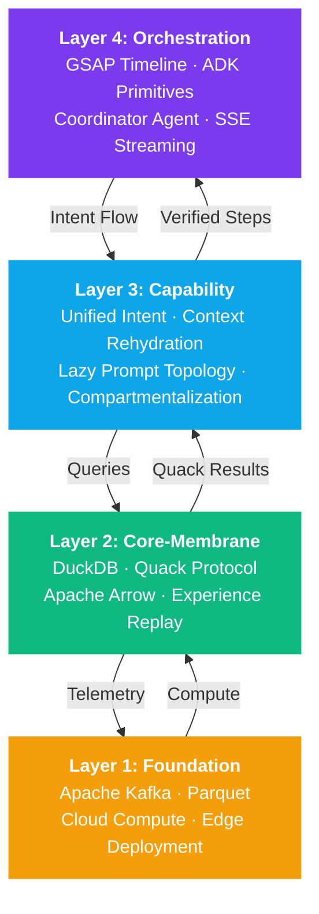

# A2A Exoskeleton Architecture

The **A2A Exoskeleton** is an agentic substrate designed to **break the dependence on heavy hardware matrix multiplication** ("Matrix-Force") by shifting to software-native indexing, zero-copy memory transport, and O(1) context orchestration.

Rather than loading the model context window with harness instructions, schemas, and static prompts, the Exoskeleton offloads structural execution to an **asynchronous capability substrate**. The LLM functions purely as an **intent engine**, while the substrate handles execution, parallel branching, and lazy materialization.


**Matrix-Force** refers to the industry-wide assumption that high-performance AI requires brute-force GPU matrix multiplication. The Exoskeleton proves this is a design choice, not a physical law — see the [No-GPU Intelligence Stack](no-gpu-intelligence-stack.md) for the full algorithmic alternative.


## The Four-Layer Stack



## The Analytic-Generative Hybrid

Traditional AI systems operate purely through generative processes — chain-of-thought reasoning that produces tokens sequentially. The A2A Exoskeleton introduces a paradigm shift: **Analytic-Generative duality**.

In this model, the system alternates between:

* **Generative Mode**: Standard LLM inference producing novel reasoning chains
* **Analytic Mode**: Structured SQL queries against the Big Lake to verify, retrieve, and ground generative outputs

This transforms <code class="expression">space.vars.agent_name</code>'s intellect from a purely generative process into a hybrid model, where every generative step can be empirically verified against historical data stored in the Big Lake.


The Analytic-Generative hybrid is inspired by architectures like **Agent57** (DeepMind, 2020), which used distributed replay memory banks to achieve superhuman performance across 57 Atari games. The Big Lake serves an analogous role — but with structured relational queries instead of simple buffers.


## Key Design Principles

### 1. Unified Collapse

Tools and multi-step workflows appear **identical** to the reasoning core. The model emits a single, unified **"Intent" call** regardless of whether the underlying task is a simple API call or a complex multi-agent coordination pipeline.

### 2. Context Rehydration

The system keeps the model's "spine" lean by only providing the **specific context needed** for a particular turn. No accumulated state, no growing prompt windows — just the exact information required for the current decision.

### 3. Substrate Parallelism

The architecture uses **speculative execution** and parallel "branch-merge" processing to hide the latency of complex tasks from the model. While the model thinks about the next step, the substrate is already executing potential futures in parallel.

### 4. Compartmentalization

Every capability is contained in an **isolated execution environment**, preventing interference between different tools or harnesses. A failing tool cannot corrupt the state of an unrelated workflow.

### 5. Verifiable Rewards

Ground truth scoring through the Big Lake server. Every generated attempt is objectively scored against structured data, not black-box environment signals.

## Matrix-Force vs. Substrate: Why This Matters

Conventional agent frameworks treat the model context as an execution dump, leading to linear context bloat O(N) and rapid model degradation. The Exoskeleton replaces this with a **Choreographed Primitive Substrate**:

| Aspect | Matrix-Force (Conventional) | Exoskeleton Substrate |
| --- | --- | --- |
| Context model | Full schema + instructions in-context every turn | O(1) delta-only rehydration via intent IDs |
| Execution | Model orchestrates (re-prompting, sequential) | Substrate orchestrates (async, off-thread) |
| Scaling | O(N) — degrades with capability count | O(1) — constant regardless of N |
| Hardware requirement | GPU-dependent matrix ops | Algorithmic intelligence on any CPU/edge |
| Latency at N=100 | 4,300–70,300 ms | **779 ms** |


**224.9x bandwidth savings.** Over an 8-turn session with 100 capabilities, the Exoskeleton uses 552 total tokens vs. 124,192 for the next-best alternative. See [Benchmark & Scaling Metrics](benchmark-scaling-metrics.md) for the full empirical validation.


## The Intent Interface

The core abstraction that enables the Unified Collapse:


interface UnifiedIntent {
  type: 'tool_call' | 'harness_execution' | 'query'
  target: string           // e.g., "big_lake", "skill_search", "remote_analytics"
  payload: Record<string, unknown>
  context?: string         // Lazy-rehydrated context ID
}

// Both calls look identical to the model:
await emitIntent({
  type: 'query',
  target: 'big_lake',
  payload: { sql: 'SELECT pattern, confidence FROM trajectory_analysis' }
});

await emitIntent({
  type: 'harness_execution',
  target: 'full_arc_agi_solver',
  payload: { task: gridTask }
});


References

* [1] Agent57: Outperforming the Atari 100K Benchmark (Badia et al., 2020)
* [2] Google ADK — SequentialAgent, ParallelAgent, LoopAgent primitives
* [3] A2A Protocol — Task-based agent communication standard

