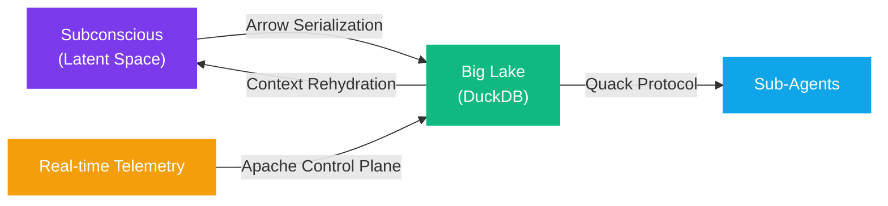

# Big Lake Server — Core-Membrane

The "Big Lake" serves as the **central repository** for all of <code class="expression">space.vars.agent_name</code>'s experiences, functioning as the memory bank used in distributed RL architectures like **Agent57**. Built on **<code class="expression">space.vars.db_engine</code>**, it provides a high-performance, columnar analytical engine embedded directly within the exoskeleton's core-membrane.

## Structured Experience Replay

While standard agents use simple replay buffers (FIFO queues of state-action pairs), <code class="expression">space.vars.agent_name</code> uses **<code class="expression">space.vars.db_engine</code>** to store and query full trajectories. This enables:

* **Relational Reasoning** — Complex SQL queries across past hidden states, action outcomes, and environmental observations
* **Temporal Pattern Mining** — Window functions and time-series analysis over millions of experience frames
* **Cross-Domain Correlation** — JOINs between disparate experience domains


A standard linear buffer would miss these patterns entirely. The Big Lake transforms experience replay from passive storage into **active analytical intelligence**.


### Pattern Discovery Query


WITH pattern_analysis AS (
  SELECT
    action_family,
    environment_type,
    AVG(reward) AS avg_reward,
    COUNT(*) AS occurrences,
    STDDEV(reward) AS reward_volatility
  FROM experiences
  WHERE timestamp > NOW() - INTERVAL '30 days'
  GROUP BY action_family, environment_type
  HAVING COUNT(*) > 100
)
SELECT
  action_family,
  environment_type,
  avg_reward,
  occurrences,
  reward_volatility,
  RANK() OVER (
    PARTITION BY environment_type
    ORDER BY avg_reward ASC
  ) AS worst_in_env
FROM pattern_analysis
ORDER BY worst_in_env
LIMIT 10;


## Membrane Control Plane

The membrane manages the bidirectional flow between the **"Subconscious"** (latent space) and the **"Big Lake"** (structured data):

| Direction | Flow | Mechanism |
| --- | --- | --- |
| Subconscious → Lake | Embedding serialization | Vector-to-table projection via Apache Arrow |
| Lake → Subconscious | Context rehydration | SQL-to-prompt injection via Lazy Prompt Topology |
| Real-time → Lake | Telemetry indexing | Apache products as the control plane router |
| Lake → Agents | Distributed query | Quack Remote Protocol |



## Apache as Control Plane

**Apache Products** serve as the control plane routing real-time telemetry into the Lake:

* **Apache Arrow** — Zero-copy data interchange between the lake and sub-agents
* **Apache Parquet** — Efficient columnar storage format for archived experience trajectories
* **Kafka / Pulsar** — Real-time event streaming from sub-agent telemetry into the Lake

## Schema Design

The Big Lake's schema is designed around **trajectory-centric storage**:

| Table | Purpose | Key Columns |
| --- | --- | --- |
| `experiences` | Raw trajectory frames | `episode_id`, `step`, `state_hash`, `action`, `reward`, `timestamp` |
| `hidden_states` | Latent representations | `episode_id`, `step`, `layer`, `embedding` (BLOB) |
| `skill_index` | Procedural artifacts | `skill_id`, `domain`, `best_skill_md`, `success_rate`, `complexity` |
| `q_values` | Twin-critic estimates | `episode_id`, `step`, `critic_a`, `critic_b`, `target` |
| `verifications` | NSF-CoT pipeline results | `reasoning_step`, `sql_query`, `result`, `passed` |

## Membrane Serialization



```typescript
interface MembraneControlPlane {
  serializeToLake(
    episodeId: string,
    step: number,
    latentState: Float32Array
  ): Promise<void>;

  rehydrateContext(
    contextId: string,
    query: string
  ): Promise<string>;
}

class CoreMembrane implements MembraneControlPlane {
  private db: Database;

  async serializeToLake(
    episodeId: string,
    step: number,
    latent: Float32Array
  ) {
    // Convert latent vector to Apache Arrow for zero-copy
    const arrowBuffer = Float32ArrayToArrow(latent);
    await this.db.run(
      'INSERT INTO hidden_states VALUES (?, ?, ?, ?)',
      [episodeId, step, 'transformer_layer_48', arrowBuffer]
    );
  }

  async rehydrateContext(
    contextId: string,
    query: string
  ): Promise<string> {
    const result = await this.db.all(query);
    return this.formatAsPromptContext(result, contextId);
  }
}
```


```sql
-- Query the lake and inject results as prompt context
SELECT
  e.action,
  e.reward,
  e.timestamp,
  hs.layer,
  AVG(hs.embedding) OVER (
    PARTITION BY e.episode_id
    ORDER BY e.step
    ROWS BETWEEN 10 PRECEDING AND CURRENT ROW
  ) AS smoothed_embedding
FROM experiences e
JOIN hidden_states hs ON e.episode_id = hs.episode_id
  AND e.step = hs.step
WHERE e.episode_id = $1
ORDER BY e.step;
```



<details>

<summary>References</summary>

* [1] Agent57: Outperforming the Atari 100K Benchmark (Badia et al., 2020)
* [2] DuckDB: An Analytical In-Process SQL Database System (Grosse et al., VLDB 2025)
* [3] Apache Arrow: A Cross-Language Development Platform for In-Memory Data

</details>
