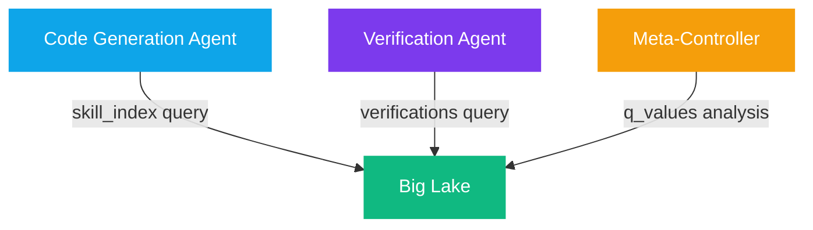

# Quack Remote Protocol

The **Quack Remote Protocol** is DuckDB's native remote access protocol, providing the exoskeleton with a low-latency, remote-access method for the Big Lake. It mirrors the speed requirements of systems like **Codex-Spark** (1,000+ tokens/second), ensuring analytical queries never become the bottleneck.

## Protocol Architecture


### Design Goals

* **Sub-millisecond query initiation** — Connection pooling and prepared statement caching
* **Streaming result sets** — Columnar Arrow batches streamed incrementally
* **Zero-copy transfers** — Arrow IPC format eliminates serialization costs
* **Authentication & scope isolation** — Each sub-agent receives scoped database access

## Remote Analytic Thinking

Through Quack, sub-agents query the central Big Lake **without replicating the full dataset**. This enables A2A interaction to remain lightweight while still having access to heavy-duty analytical insights.

### Concurrent Sub-Agent Scenario



All three query the same Big Lake through Quack, but each sees only its **scoped view**. No data replication, no stale caches, no consistency issues.

## Without vs. With Quack

| Concern | Without Quack | With Quack |
| --- | --- | --- |
| Data locality | Each agent loads full dataset | Centralized, queried on-demand |
| Memory footprint | O(n) per agent | O(1) per agent |
| Consistency | Eventual / stale | Strong (single source of truth) |
| Latency | Local reads (high memory cost) | Remote reads (low memory, Arrow streaming) |
| Deployment | Coupled to data | Decoupled — agents can be edge-deployed |

## Quack Client Implementation


class BigLakeClient {
  private conn: any;

  async connect(config: QuackClientConfig) {
    this.conn = await connect(
      `quack://${config.host}:${config.port}/${config.scope}`,
      { auth: config.authToken }
    );
  }

  async querySkillIndex(taskDescription: string, limit = 5) {
    return this.conn.all(
      `SELECT skill_id, domain, best_skill_md, success_rate
       FROM skill_index
       WHERE domain ILIKE '%' || $1 || '%'
          OR best_skill_md ILIKE '%' || $1 || '%'
       ORDER BY success_rate * complexity_weight DESC
       LIMIT ?`,
      [taskDescription, limit]
    );
  }

  async verifyReasoning(stepId: string, proposedSql: string) {
    const result = await this.conn.all(proposedSql);
    await this.conn.run(
      'INSERT INTO verifications VALUES (?, ?, ?, ?)',
      [stepId, proposedSql, JSON.stringify(result), result.length > 0]
    );
    return result;
  }
}


## Server Startup



```bash
duckdb_server \
  --database /data/big_lake.duckdb \
  --host 0.0.0.0 \
  --port 5432 \
  --protocol both \
  --access-mode scoped \
  --auth-token $QUACK_AUTH_TOKEN \
  --memory-limit 4GB \
  --threads 8
```


```
quack://biglake.internal:5432/code_agent
quack://biglake.internal:5432/verify_agent
quack://biglake.internal:5432/meta_controller
```




Each sub-agent connection uses a **scoped path segment** (e.g., `/code_agent`, `/verify_agent`). This is enforced server-side and prevents cross-agent data leakage.


<details>

<summary>References</summary>

* [5] Codex-Spark: High-throughput inference architecture (1000+ tok/s)
* [6] DuckDB Server / Quack Protocol Documentation (duckdb.org)
* [7] A2A Protocol: Agent-to-Agent communication (Google, 2025)
* [8] Arrow IPC: Zero-copy data interchange format (Apache Software Foundation)

</details>
