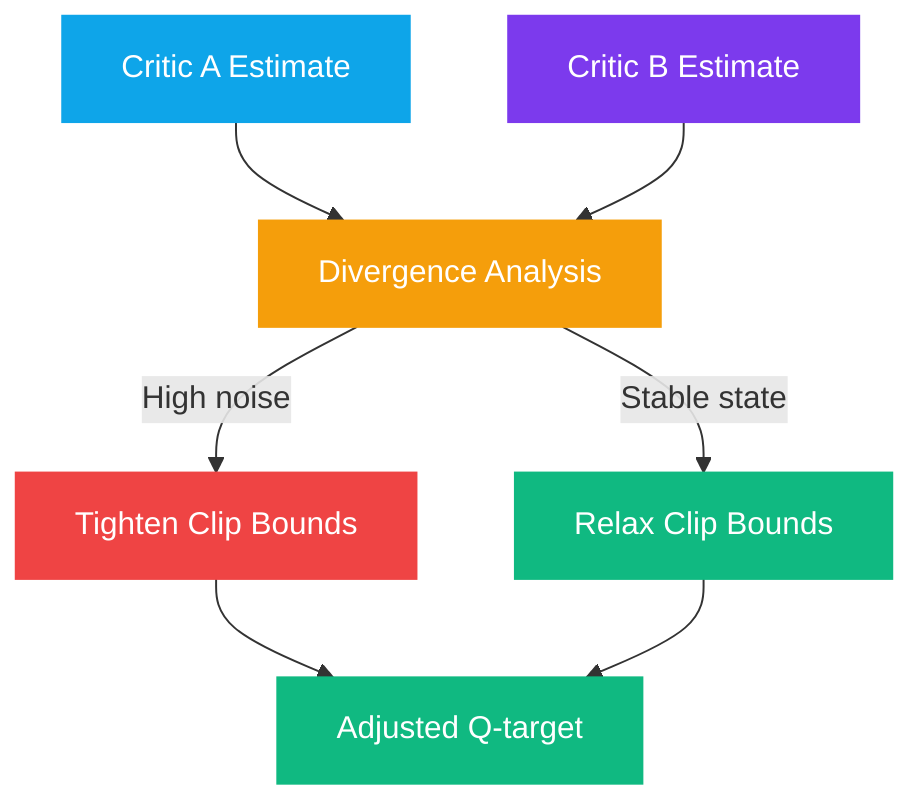

# Double Q-Learning in the Lake

The Big Lake server mitigates the vulnerabilities of **overestimation** through a novel integration of **Double Q-Learning** with DuckDB's analytical capabilities.

## The Overestimation Problem

Standard Q-learning suffers from a fundamental flaw: because the max operator selects both the **action** and the **target value**, the estimator is biased toward **overestimating** Q-values.

* Overly optimistic value estimates
* Poor exploration-exploitation balance
* Instability in long-horizon tasks

## Twin-Critic Analysis

<code class="expression">space.vars.agent_name</code> stores the estimates of her **Twin Critics** within the Big Lake. By analyzing the **distribution** of these values over millions of past frames, she can dynamically adjust her **Clipped Double Q-learning** bounds.

### The Innovation

In states where historical data indicates **high noise** (large divergence between Critic A and Critic B), the system automatically favors **underestimation** by tightening the clip bounds. In stable states, the bounds are relaxed for more aggressive value estimation.



## Dynamic Clip Bound Analysis


WITH critic_stats AS (
  SELECT
    state_cluster,
    AVG(critic_a) AS mean_a,
    AVG(critic_b) AS mean_b,
    STDDEV(critic_a - critic_b) AS divergence,
    COUNT(*) AS sample_count
  FROM q_values
  WHERE timestamp > NOW() - INTERVAL '7 days'
  GROUP BY state_cluster
  HAVING COUNT(*) > 500
)
SELECT
  state_cluster,
  divergence,
 sample_count,
  CASE
    WHEN divergence > 2.0 THEN 0.05   -- High noise: very tight clip
    WHEN divergence > 1.0 THEN 0.10   -- Medium noise: moderate clip
    WHEN divergence > 0.5 THEN 0.20   -- Low noise: relaxed clip
    ELSE 0.30                         -- Stable: standard clip
  END AS adjusted_clip_bound,
  CASE
    WHEN divergence > 1.5 THEN 0.95   -- Favor underestimation
    WHEN divergence > 0.8 THEN 0.98
    ELSE 1.00                         -- Neutral
  END AS underestimation_factor
FROM critic_stats
ORDER BY divergence DESC;


## RLVR: Verifiable Rewards

In her **RLVR (Reinforcement Learning with Verifiable Rewards)** loop, the Big Lake serves as the **ground truth** against which all generated attempts are scored.

### Multi-Dimensional Reward Computation




### Correctness (50% weight)

Does the output match the expected result?

```sql
SELECT COUNT(*) AS matches FROM verification_results
WHERE attempt_id = $1 AND verification_passed = true
```




### Efficiency (30% weight)

How does the execution cost compare to historical optimal?

```sql
SELECT $computationCost / NULLIF(
  (SELECT AVG(optimal_cost) FROM task_optimals WHERE task_type = $2), 0
) AS cost_ratio
```




### Novelty (20% weight)

Is this approach new or a repeat of known strategies?

```sql
SELECT AVG(similarity) AS novelty_score
FROM approach_similarity
WHERE approach_hash = $1
```





**Key advantage**: Unlike standard RL where rewards are sparse and noisy, RLVR provides deterministic verification through SQL queries, consistent ground truth, and rich multi-dimensional reward shaping.


### RLVR Reward Implementation


async function computeRLVReward(
  attempt: AgentAttempt,
  lake: BigLakeClient
): Promise<RLVReward> {
  const queries: string[] = [];

  // 1. Correctness
  const correctQ = `
    SELECT COUNT(*) AS matches FROM verification_results
    WHERE attempt_id = '${attempt.id}'
      AND verification_passed = true
  `;
  queries.push(correctQ);
  const [{ matches }] = await lake.query(correctQ);
  const correctness = {
    score: matches,
    max: attempt.totalChecks
  };

  // 2. Efficiency
  const effQ = `
    SELECT ${attempt.computationCost} / NULLIF(
      (SELECT AVG(optimal_cost) FROM task_optimals
       WHERE task_type = '${attempt.taskType}'), 0
    ) AS cost_ratio
  `;
  queries.push(effQ);
  const [{ cost_ratio }] = await lake.query(effQ);
  const efficiency = {
    score: 1 / Math.max(cost_ratio, 0.01),
    max: 1.0
  };

  // 3. Novelty
  const novQ = `
    SELECT AVG(similarity) AS novelty_score
    FROM approach_similarity WHERE approach_hash = '${attempt.approachHash}'
  `;
  queries.push(novQ);
  const [{ novelty_score }] = await lake.query(novQ);
  const novelty = {
    score: 1 - (novelty_score || 0),
    max: 1.0
  };

  return {
    total:
      (correctness.score / correctness.max) * 0.5 +
      efficiency.score * 0.3 +
      novelty.score * 0.2,
    components: { correctness, efficiency, novelty },
    queries
  };
}


<details>

<summary>References</summary>

* [13] Twin Delayed DDPG (TD3) — Fujimoto et al., 2018
* [14] Clipped Double Q-Learning — Addressing overestimation bias
* [15] Distributional RL — Analyzing value distributions over episodes
* [16] Dynamic clip adjustment based on historical noise analysis
* [17] RLVR: Reinforcement Learning with Verifiable Rewards
* [18] Ground truth scoring through structured database queries

</details>
